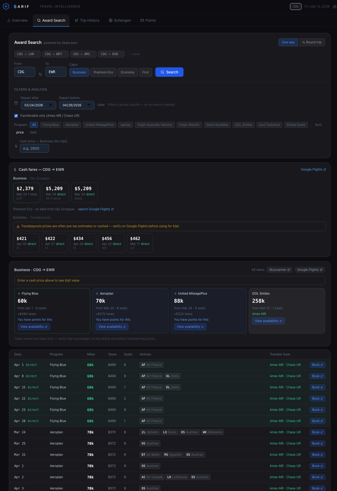

<p align="center">
  
</p>

<h1 align="center">Sarif</h1>

<p align="center">
  Travel intelligence dashboard for frequent flyers and digital nomads.
  <br>Award search, points tracking, US and Schengen stay counters. Runs locally.
</p>

## Quickstart

```bash
git clone https://github.com/jcdentonintheflesh/sarif.git
cd sarif/app
npm install
cp src/data/travelHistory.example.js src/data/travelHistory.js
cp .env.example .env
npm run dev
```

Open [localhost:5173](http://localhost:5173). Append `?demo` to the URL to try it with sample data.

Don't have Git? Click the green **Code** button on the repo page, hit **Download ZIP**, unzip it, and run the same commands starting from `cd sarif/app`.

## API keys (optional)

Works without any API keys. Award search and live prices turn on once you add them.

| Key | What it powers | Where to get it | Cost |
|-----|---------------|-----------------|------|
| `SEATS_API_KEY` | Award search | [seats.aero](https://seats.aero) | $9.99/mo |
| `RAPIDAPI_KEY` | Business/PE cash prices | [Sky Scrapper on RapidAPI](https://rapidapi.com/apiheya/api/sky-scrapper) | Free (100 req/mo) or $8.99/mo (10k req) |
| `TRAVELPAYOUTS_TOKEN` | Economy cash baseline | [travelpayouts.com](https://www.travelpayouts.com/developers/api) | Free |

Add keys to `.env` and restart `npm run dev` — it runs both the frontend and the API server automatically.

## Overview


**Award Search** pulls live award availability from [seats.aero](https://seats.aero), which aggregates availability across 30+ airline loyalty programs (United, Aeroplan, Flying Blue, etc.) into one API. Sarif shows these results alongside cash prices from [Sky Scrapper](https://rapidapi.com/apiheya/api/sky-scrapper) (business/premium economy) and [Travelpayouts](https://www.travelpayouts.com/developers/api) (economy), so you can compare points vs. dollars on the same screen.

**Points & Miles** tracks balances across all your programs and shows which transferable currencies (Amex MR, Chase UR, etc.) can move where.

**US Presence Tracker** counts rolling 180-day and 365-day totals, runs the IRS Substantial Presence Test (the 3-year weighted formula), and suggests exit dates so you don't accidentally trigger tax residency.

**Schengen Tracker** does the same for the 90/180-day Schengen rule.

**Trip Planner** lets you simulate future trips against both US and Schengen limits before you book anything.



No accounts, no cloud, no tracking. Data stays on your machine.

## Data setup

Edit `src/data/travelHistory.js` with your trips, points, and programs:
- US entry/exit dates (get yours from [i94.cbp.dhs.gov](https://i94.cbp.dhs.gov))
- Schengen stays
- Points balances and loyalty programs

This file is gitignored and never gets committed. See `travelHistory.example.js` for the full schema.

## Stack

React 19, Vite, Tailwind CSS, Recharts, Express (API proxy), localStorage

## License

[MIT](LICENSE)

---

Built by [@vxdenton](https://x.com/vxdenton)
